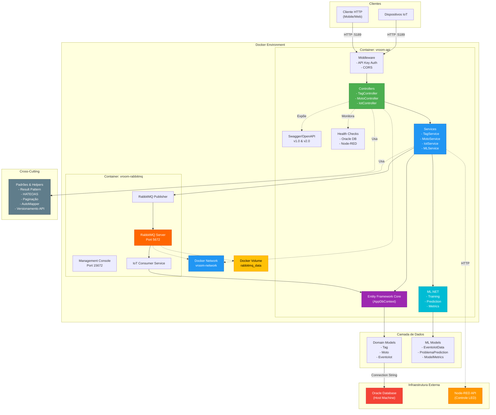
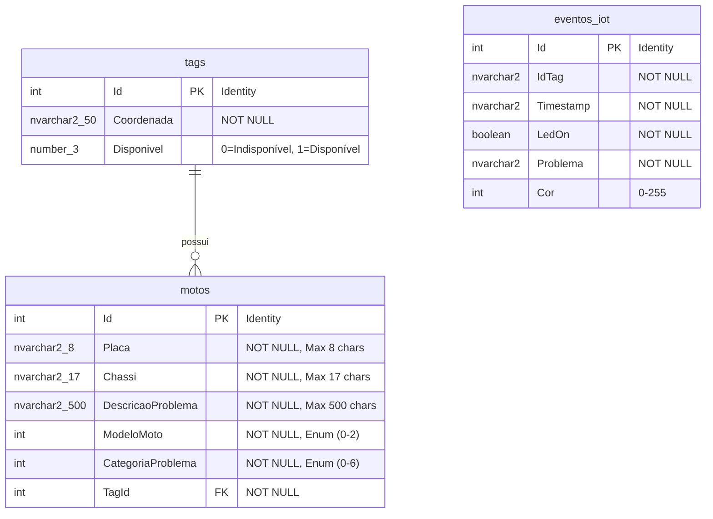

# Vroom API


Essa é a Vroom, projeto finalista para o Challenge FIAP 2025 do curso de Análise e Desenvolvimento de Sistemas, onde os usuários podem registrar motos, tags e manipular as tags comunicando com o IOT

&nbsp;

 


## Funcionalidades

- **Registro de eventos IoT** com processamento assíncrono via RabbitMQ
- **Gerenciamento de motocicletas** com categorização de problemas
- **Controle de tags de localização** com coordenadas GPS
- **Sistema de monitoramento e diagnóstico** com Health Checks
- **Machine Learning** para predição de categorias de problemas
- **API Versionada** (v1.0 e v2.0)
- **HATEOAS** para navegação hipermídia
- **Controle de LED** via Node-RED para dispositivos IoT

# Documentação da API

## Base URL
```
http://localhost:5189/v2.0
```

## Autenticação
Todas as requisições requerem autenticação via API Key no header:
```
X-Api-Key: sua-api-key-aqui
```

## IoT

### POST /v2.0/Iot/historico

Recebe e processa um evento IoT de forma assíncrona usando RabbitMQ

**Request Body (JSON)**

```json
{
  "idTag": 1,
  "timestamp": "2024-01-15T10:30:00",
  "ledOn": true,
  "problema": "Temperatura alta detectada",
  "cor": 1
}
```

**Parâmetros**

| Parâmetro   | Tipo      | Descrição                                    |
| :---------- | :-------- | :------------------------------------------- |
| `idTag`     | `integer` | **Obrigatório**. ID da tag associada        |
| `timestamp` | `string`  | **Obrigatório**. Timestamp do evento        |
| `ledOn`     | `boolean` | Indica se o LED está ligado                  |
| `problema`  | `string`  | Descrição do problema detectado              |
| `cor`       | `integer` | Código da cor do LED (0-6)                |

**Respostas**

| Código | Descrição | Conteúdo |
| :----- | :-------- | :---- |
| `202`  | Aceito    | Evento enviado para processamento assíncrono |
| `400`  | Dados inválidos | Mensagem de erro |

### GET /v2.0/Iot

Retorna todos os eventos IoT com paginação e HATEOAS

**Query Parameters**

| Parâmetro  | Tipo      | Descrição                          |
| :--------- | :-------- | :--------------------------------- |
| `page`     | `integer` | Número da página (padrão: 1)       |
| `pageSize` | `integer` | Itens por página (padrão: 10)      |

**Respostas**

| Código | Descrição | Conteúdo |
| :----- | :-------- | :---- |
| `200`  | OK        | Lista paginada de eventos IoT com links HATEOAS |

### POST /v2.0/Iot/set

Envia comando para controlar o LED de uma tag IoT via Node-RED

**Request Body (JSON)**

```json
{
  "tagId": 1,
  "ledOn": true
}
```

**Respostas**

| Código | Descrição | Conteúdo |
| :----- | :-------- | :---- |
| `200`  | OK        | Comando enviado com sucesso |
| `400`  | Erro      | Mensagem de erro |

### POST /v2.0/Iot/ml/train

Treina o modelo de Machine Learning com dados históricos de eventos IoT

**Respostas**

| Código | Descrição | Conteúdo |
| :----- | :-------- | :---- |
| `200`  | OK        | Modelo treinado com sucesso |
| `400`  | Erro      | Dados insuficientes ou erro no treinamento |

### POST /v2.0/Iot/ml/predict

Prediz a categoria de um problema usando ML.NET

**Request Body (JSON)**

```json
{
  "ledOn": true,
  "cor": 1,
  "problema": "Temperatura alta"
}
```

**Respostas**

| Código | Descrição | Conteúdo |
| :----- | :-------- | :---- |
| `200`  | OK        | Categoria predita com nível de confiança |
| `400`  | Erro      | Modelo não treinado ou erro na predição |

### GET /v2.0/Iot/ml/metrics

Obtém métricas do modelo de Machine Learning treinado

**Respostas**

| Código | Descrição | Conteúdo |
| :----- | :-------- | :---- |
| `200`  | OK        | Métricas de performance do modelo |
| `400`  | Erro      | Modelo não treinado |

### GET /v2.0/Iot/ml/status

Verifica o status do modelo de Machine Learning

**Respostas**

| Código | Descrição | Conteúdo |
| :----- | :-------- | :---- |
| `200`  | OK        | Status do modelo (treinado ou não) |

## Motocicletas

### POST /v2.0/Moto

Cria uma nova moto no sistema

**Request Body (JSON)**

```json
{
  "placa": "ABC-1234",
  "chassi": "9BWZZZ377VT004251",
  "descricaoProblema": "Motor fazendo ruído estranho",
  "modeloMoto": 0,
  "categoriaProblema": 0,
  "tagId": 1
}
```

**Parâmetros**

| Parâmetro           | Tipo       | Descrição                               |
| :------------------ | :--------- | :-------------------------------------- |
| `placa`             | `string`   | **Obrigatório**. Placa da moto (max 8 chars) |
| `chassi`            | `string`   | **Obrigatório**. Número do chassi (max 17 chars) |
| `descricaoProblema` | `string`   | **Obrigatório**. Descrição do problema (max 500 chars) |
| `modeloMoto`        | `integer`  | **Obrigatório**. Modelo da moto (0-2)   |
| `categoriaProblema` | `integer`  | **Obrigatório**. Categoria do problema (0-6) |
| `tagId`             | `integer`  | **Obrigatório**. ID da tag associada    |

**Modelos de Moto:**
- `0` - MOTTUPOP (Modelo básico)
- `1` - MOTTUSPORT (Modelo esportivo)
- `2` - MOTTUE (Modelo elétrico)

**Categorias de Problema:**
- `0` - MECANICO
- `1` - ELETRICO
- `2` - DOCUMENTACAO
- `3` - ESTETICO
- `4` - SEGURANCA
- `5` - MULTIPLO
- `6` - CONFORME

**Respostas**

| Código | Descrição | Conteúdo |
| :----- | :-------- | :---- |
| `201`  | Criada    | Moto criada com sucesso |
| `400`  | Dados inválidos | Mensagem de erro |

### GET /v2.0/Moto/{id}

Busca uma moto específica pelo ID

**Path Parameters**

| Parâmetro | Tipo      | Descrição                              |
| :-------- | :-------- | :------------------------------------- |
| `id`      | `integer` | **Obrigatório**. ID da moto desejada   |

**Respostas**

| Código | Descrição | Conteúdo |
| :----- | :-------- | :---- |
| `200`  | OK        | Dados da moto com links HATEOAS |
| `404`  | Não encontrada | Mensagem de erro |

### GET /v2.0/Moto

Retorna todas as motos cadastradas no sistema com paginação

**Query Parameters**

| Parâmetro  | Tipo      | Descrição                          |
| :--------- | :-------- | :--------------------------------- |
| `page`     | `integer` | Número da página (padrão: 1)       |
| `pageSize` | `integer` | Itens por página (padrão: 10)      |

**Respostas**

| Código | Descrição | Conteúdo |
| :----- | :-------- | :---- |
| `200`  | OK        | Lista paginada de motos com links HATEOAS |

### PUT /v2.0/Moto/{id}

Atualiza os dados de uma moto existente

**Path Parameters**

| Parâmetro | Tipo      | Descrição                              |
| :-------- | :-------- | :------------------------------------- |
| `id`      | `integer` | **Obrigatório**. ID da moto            |

**Request Body (JSON)**

```json
{
  "placa": "XYZ-5678",
  "chassi": "9BWZZZ377VT004251",
  "descricaoProblema": "Problema no freio traseiro",
  "modeloMoto": 1,
  "categoriaProblema": 4,
  "tagId": 2
}
```

**Respostas**

| Código | Descrição | Conteúdo |
| :----- | :-------- | :---- |
| `200`  | OK        | Moto atualizada |
| `404`  | Não encontrada | Mensagem de erro |

### DELETE /v2.0/Moto/{id}

Remove uma moto do sistema

**Path Parameters**

| Parâmetro | Tipo      | Descrição                                |
| :-------- | :-------- | :--------------------------------------- |
| `id`      | `integer` | **Obrigatório**. ID da moto a ser removida |

**Respostas**

| Código | Descrição |
| :----- | :-------- |
| `204`  | Removida com sucesso |
| `404`  | Não encontrada |

## Tags de Localização

### POST /v2.0/Tag

Cria uma nova tag no sistema

**Request Body (JSON)**

```json
{
  "coordenada": "-23.5505,-46.6333",
  "disponivel": 1
}
```

**Parâmetros**

| Parâmetro    | Tipo     | Descrição                                    |
| :----------- | :------- | :------------------------------------------- |
| `coordenada` | `string` | **Obrigatório**. Coordenadas GPS (lat,long) (max 50 chars) |
| `disponivel` | `byte`   | **Obrigatório**. Status (0=indisponível, 1=disponível) |

**Respostas**

| Código | Descrição | Conteúdo |
| :----- | :-------- | :---- |
| `201`  | Criada    | Tag criada com sucesso |
| `400`  | Dados inválidos | Mensagem de erro |

### GET /v2.0/Tag/{id}

Busca uma tag específica pelo ID

**Path Parameters**

| Parâmetro | Tipo      | Descrição                              |
| :-------- | :-------- | :------------------------------------- |
| `id`      | `integer` | **Obrigatório**. ID da tag desejada    |

**Respostas**

| Código | Descrição | Conteúdo |
| :----- | :-------- | :---- |
| `200`  | OK        | Dados da tag com links HATEOAS |
| `404`  | Não encontrada | Mensagem de erro |

### GET /v2.0/Tag

Retorna todas as tags cadastradas no sistema com paginação

**Query Parameters**

| Parâmetro  | Tipo      | Descrição                          |
| :--------- | :-------- | :--------------------------------- |
| `page`     | `integer` | Número da página (padrão: 1)       |
| `pageSize` | `integer` | Itens por página (padrão: 10)      |

**Respostas**

| Código | Descrição | Conteúdo |
| :----- | :-------- | :---- |
| `200`  | OK        | Lista paginada de tags com links HATEOAS |

### PUT /v2.0/Tag/{id}

Atualiza os dados de uma tag existente

**Path Parameters**

| Parâmetro | Tipo      | Descrição                              |
| :-------- | :-------- | :------------------------------------- |
| `id`      | `integer` | **Obrigatório**. ID da tag             |

**Request Body (JSON)**

```json
{
  "coordenada": "-23.5505,-46.6333",
  "disponivel": 0
}
```

**Respostas**

| Código | Descrição | Conteúdo |
| :----- | :-------- | :---- |
| `200`  | OK        | Tag atualizada |
| `404`  | Não encontrada | Mensagem de erro |

### DELETE /v2.0/Tag/{id}

Remove uma tag do sistema

**Path Parameters**

| Parâmetro | Tipo      | Descrição                                |
| :-------- | :-------- | :--------------------------------------- |
| `id`      | `integer` | **Obrigatório**. ID da tag a ser removida |

**Respostas**

| Código | Descrição |
| :----- | :-------- |
| `204`  | Removida com sucesso |
| `404`  | Não encontrada |

## Health Checks

### GET /health

Endpoint de health check para monitoramento da API

**Respostas**

| Código | Descrição | Conteúdo |
| :----- | :-------- | :---- |
| `200`  | Healthy   | Status de todos os componentes (DB, Node-RED) |

### GET /health-dashboard

Dashboard visual para monitoramento da saúde da aplicação

## Variáveis de Ambiente

Para rodar esse projeto, você vai precisar adicionar as seguintes variáveis de ambiente no `appsettings.json`

```json
{
  "ConnectionStrings": {
    "OracleConnection": "Data Source=seuBanco;User Id=seuRM;Password=suaSenha"
  },
  "Authentication": {
    "ApiKey": "minha-api-key"
  },
  "RabbitMQ": {
    "HostName": "localhost",
    "Port": 5672,
    "UserName": "guest",
    "Password": "guest",
    "EventoIotQueueName": "evento_iot_queue",
    "EventoIotExchangeName": "evento_iot_exchange",
    "EventoIotRoutingKey": "evento_iot"
  }
}
```

## Como Executar

### Opção 1: Executar com Docker Compose

Esta é a forma mais rápida e fácil de executar o projeto, pois o Docker Compose configura automaticamente a API e o RabbitMQ.

#### Pré-requisitos

- **Docker Desktop** (Windows/Mac) ou **Docker Engine + Docker Compose** (Linux)
- **Oracle Database** (deve estar acessível externamente ao container)

#### Passos para Executar

1. **Clone o repositório**
```bash
git clone https://github.com/gabrielmarcello/VroomAPI.git
cd VroomAPI
```

2. **Configure as variáveis de ambiente no docker-compose.yml**
   
   Edite o arquivo `docker-compose.yml` e atualize as seguintes variáveis de ambiente no serviço `vroom-api`:

```yaml
environment:
  - ConnectionStrings__OracleConnection=Data Source=SEU_ORACLE_HOST;User Id=SEU_RM;Password=SUA_SENHA
  - Authentication__ApiKey=minha-api-key 
```

3. **Inicie os serviços com Docker Compose**
```bash
docker-compose up -d
```


4. **Verifique se os containers estão rodando**
```bash
docker-compose ps
```

5. **Acesse a aplicação**
   - **API Swagger**: http://localhost:5189/swagger
   - **Health Dashboard**: http://localhost:5189/health-dashboard
   - **Health Check**: http://localhost:5189/health
   - **RabbitMQ Management**: http://localhost:15672
     - Usuário: `guest`
     - Senha: `guest`

### Opção 2: Executar Localmente (Desenvolvimento)

Para desenvolvimento local sem Docker, com controle total sobre cada componente.

#### Pré-requisitos

- .NET 8.0 SDK
- Oracle Database
- RabbitMQ Server
- Node-RED (opcional)

#### Instalação

1. **Clone o repositório**
```bash
git clone https://github.com/gabrielmarcello/VroomAPI.git
cd VroomAPI\VroomAPI
```

2. **Configure a string de conexão**
   - Edite o `appsettings.json` com suas credenciais do Oracle e RabbitMQ

3. **Instale as dependências**
```bash
dotnet restore
```

4. **Configure o RabbitMQ**
   - Instale e inicie o RabbitMQ Server
   - Acesse o management console: `http://localhost:15672`
   - Credenciais padrão: guest/guest

5. **Configure o banco de dados**
```bash
dotnet tool install --global dotnet-ef

dotnet ef migrations add InitialCreate
dotnet ef database update
```

6. **Execute a aplicação**
```bash
dotnet run
```

7. **Acesse a API**
   - Swagger: `http://localhost:5189/swagger`
   - Health Dashboard: `http://localhost:5189/health-dashboard`
   - Health Check: `http://localhost:5189/health`

## Executar Testes

```bash
cd VroomAPI.Test
dotnet test
```

## Arquitetura

O projeto utiliza:
- **ASP.NET Core 8.0** - Framework principal
- **Oracle Database** - Banco de dados
- **Entity Framework Core** - ORM
- **RabbitMQ** - Message Broker para processamento assíncrono
- **ML.NET** - Machine Learning para predição de problemas
- **AutoMapper** - Mapeamento de objetos
- **Swagger/OpenAPI** - Documentação da API
- **Health Checks** - Monitoramento da aplicação
- **API Versioning** - Versionamento da API (v1.0 e v2.0)
- **Docker & Docker Compose** - Containerização e orquestração





### Justificativa da Arquitetura

#### **Padrão de Arquitetura Escolhido: Clean Architecture**

O projeto adota a **Clean Architecture**, garantindo separação de responsabilidades, baixo acoplamento e alta testabilidade.

### Camadas Principais

1. **Controllers**: Recebem requisições HTTP e orquestram as operações
2. **Services**: Contêm a lógica de negócio e regras específicas do domínio
3. **DTOs (Data Transfer Objects)**: Objetos para transferência de dados entre camadas
4. **Models**: Representam as entidades do domínio
5. **Interfaces**: Definem contratos para inversão de dependência
6. **Message Broker**: RabbitMQ para processamento assíncrono de eventos IoT
7. **ML Models**: Modelos de Machine Learning para predição de problemas

#### **Tecnologias Utilizadas**

- **ASP.NET Core 8.0**: Framework robusto para APIs REST
- **Oracle + EF Core 9.0**: Persistência de dados com ORM e migrations
- **RabbitMQ 7.1**: Message broker para processamento assíncrono
- **ML.NET 3.0**: Framework de Machine Learning
- **AutoMapper 12.0**: Conversão automática entre objetos
- **Swagger/OpenAPI**: Documentação interativa da API
- **Health Checks**: Monitoramento de Oracle DB e Node-RED
- **Docker & Docker Compose**: Containerização e orquestração de serviços

#### **Benefícios da Arquitetura Implementada**

- **Escalabilidade**: Estrutura modular com processamento assíncrono via RabbitMQ
- **Manutenibilidade**: Código organizado e fácil de evoluir
- **Testabilidade**: Camadas desacopladas com suporte a mocks e testes de integração
- **Flexibilidade**: Fácil troca de implementações e integração de novas features
- **Observabilidade**: Health checks e dashboards de monitoramento
- **Performance**: Processamento assíncrono de eventos IoT
- **Inteligência**: Machine Learning integrado para predição de problemas
- **Portabilidade**: Docker garante execução consistente em qualquer ambiente
- **Facilidade de Deploy**: Docker Compose simplifica a implantação em produção

#### **Padrões de Design Aplicados**

- **Repository Pattern**: Abstração da camada de dados
- **Service Pattern**: Encapsulamento da lógica de negócio
- **Dependency Injection**: Inversão de controle para baixo acoplamento
- **DTO Pattern**: Controle sobre dados transferidos entre camadas
- **Result Pattern**: Tratamento consistente de erros e sucessos
- **HATEOAS**: Hypermedia As The Engine Of Application State
- **Publisher/Subscriber**: Comunicação assíncrona via RabbitMQ
- **Background Service**: Processamento de mensagens em background

## Estrutura do Projeto

```
VroomAPI/
├── VroomAPI/
│   ├── Abstractions/          # Result Pattern e Error handling
│   ├── Authentication/         # API Key authentication
│   ├── Configuration/          # Configurações (RabbitMQ, etc)
│   ├── Controllers/            # Endpoints da API
│   ├── Data/                   # DbContext e configurações do EF Core
│   ├── DTOs/                   # Data Transfer Objects
│   ├── Helpers/                # Helpers (HATEOAS, Pagination)
│   ├── Interface/              # Interfaces de serviços
│   ├── Mappings/               # AutoMapper profiles
│   ├── Migrations/             # EF Core migrations
│   ├── ML/                     # Machine Learning models e lógica
│   ├── Model/                  # Entidades do domínio
│   ├── Service/                # Implementação dos serviços
│   │   └── RabbitMQ/          # Serviços de mensageria
│   └── Program.cs              # Configuração da aplicação
│
├── VroomAPI.Test/              # Projeto de testes
│   └── MotoTest.cs             # Testes de integração
│
├── Dockerfile                  # Definição da imagem Docker da API
├── docker-compose.yml          # Orquestração de containers (API + RabbitMQ)
├── .dockerignore               # Arquivos ignorados pelo Docker build
└── README.md                   # Documentação do projeto
```
## Autores

- [@Gabriel Marcello](https://github.com/gabrielmarcello) RM556783 2TDSPW
- [@Guilherme Guimarães](https://github.com/Guimaraes131) RM557074 2TDSA
- [@Matheus Luna](https://github.com/mlunahodov) RM555547 2TDSA